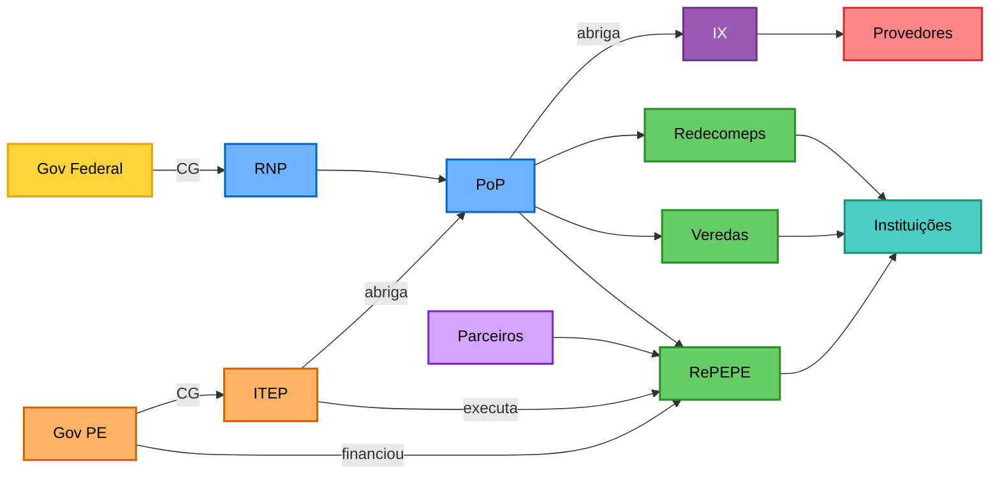

# PoP-PE
## Ponto de Presença da RNP em Pernambuco

Conectividade Avançada para Pesquisa, Educação e Inovação

---
layout: presenter
presenterImage: 'https://vp2uploads.s3.amazonaws.com/21350/21/palestrantes/2f3978c11976c90c42439749a01cdb138e83fc6c.jpeg'
---

# Zuleika Tenório Cavalcanti do Nascimento

**Coordenadora Administrativa e Técnica - PoP-PE**

Instituto de Tecnologia de Pernambuco (ITEP)

**Contato**
- zuleika.tenorio@pop-pe.rnp.br
- [www.pop-pe.rnp.br](https://www.pop-pe.rnp.br)

---
layout: default
---

# Agenda

<v-clicks>

- **Visão Estrutural** - Como tudo se conecta
- **O que é a RNP** - Rede Nacional de Ensino e Pesquisa
- **Sistema RNP** - Clientes qualificáveis e requisitos
- **Pontos de Presença (PoPs)** - Objetivos e papel estratégico
- **Parceria ITEP e RNP** - Acordo de Cooperação Técnica
- **PoP-PE** - Estrutura e equipe técnica
- **RePEPE** - Rede Pernambucana de Pesquisa e Educação
- **IX.br** - Ponto de Troca de Tráfego
- **Contrato de Gestão** - Recursos e entregas ao Estado
- **Redecomep** - Rede Metropolitana de Recife
- **Desafios** - Operacionais e estratégicos

</v-clicks>

---

# Estrutura e Relacionamentos

---
layout: new-section
---

# RNP
## Rede Nacional de Ensino e Pesquisa

---

# O que é a RNP [1]

<v-clicks>

A **Rede Nacional de Ensino e Pesquisa (RNP)** é uma organização social qualificada pelo MCTI.

- Criada em 1989
- Primeira rede acadêmica do Brasil
- Infraestrutura nacional de comunicação

**Mantida pelo Programa Interministerial RNP (PRORNP)** [7]

MCTI | MEC | MCom | Saúde | Cultura | Defesa

</v-clicks>

---

# Objetivos da RNP [2,8,9]

<v-clicks>

## Missão

Promover o uso de Tecnologias da Informação e Comunicação (TIC) de forma inovadora, avançando **ciência e educação para todos**.

## Metas Principais

- **Infraestrutura** - Backbone Ipê, PoPs estaduais, Redecomep e infovias
- **Conectividade Avançada** - Internet acadêmica de alta velocidade (1-100 Gbps)
- **Serviços Digitais** - eduroam (3.800+ pontos), CAFe (320+ instituições), ConferênciaWeb
- **PD&I** - Plataformas de experimentação e inovação tecnológica
- **Capacitação** - Escola Superior de Redes (50 mil+ alunos, 100+ cursos, 19 anos)

</v-clicks>

---

# Quem Pode Fazer Parte da RNP [1,2,3,10]

<v-clicks>

## 6 Classes de Organizações Usuárias

- **Instituições de educação superior e pesquisa**
- **Agências de fomento à pesquisa**
- **Estabelecimentos de saúde com ensino e pesquisa**
- **Museus e institutos culturais**
- **Ambientes promotores de inovação**
- **Empresas inovadoras**

## Empresas Inovadoras incluem:

- Uso de serviços avançados, acesso a centros de pesquisa
- Laboratórios, hardware, software
- Colaboração em projetos multi-institucionais

</v-clicks>

---

# Requisitos para Adesão [3,4]

<v-clicks>

**Como Aderir**
- Solicitação via portal RNP (página "Assine" ou "Faça Parte")
- Preenchimento de formulário de interesse
- RNP entrará em contato para formalizar adesão

**Recursos Necessários**
- Infraestrutura técnica adequada
- Recursos humanos capacitados

**Serviços Específicos**
- Alguns serviços requerem adesão à CAFe (Comunidade Acadêmica Federada)
- Exemplo: eduroam, conferência web
- **Catálogo completo**: [rnp.br/servicos](https://www.rnp.br/servicos/)

</v-clicks>

---
layout: new-section
---

# Pontos de Presença
## PoPs da RNP

---

# O que são os PoPs [2,11]

<v-clicks>

Os **PoPs (Pontos de Presença)** estão espalhados pelas 27 unidades da federação, operando o backbone e garantindo atendimento às comunidades de **educação, pesquisa, saúde e cultura**.

## Estrutura

- **Equipes técnicas e administrativas** - Garantem acesso à Rede Ipê
- **Instituições Abrigo** - Instalados em organizações clientes (maioria em universidades federais)
- **Conexões diretas e indiretas** - Via PoPs, redes metropolitanas ou redes acadêmicas regionais

 

## Missão

Apoiar a RNP na execução dos objetivos do PRORNP, promovendo **conectividade e ações inovadoras em TIC** para usuários locais, regionais e nacionais.

</v-clicks>

---
layout: new-section
---

# Parceria ITEP e RNP
## Acordo de Cooperação Técnica

---

# Parceria ITEP e RNP [6]

## Acordo de Cooperação Técnica

<v-clicks>

- **Formalização**: 2022
- **Vigência**: 60 meses
- **Instituição Abrigo**: ITEP (Instituto de Tecnologia de Pernambuco)
- **Localização**: Av. Professor Luiz Freire, 700 - Cidade Universitária, Recife

</v-clicks>

## Objetivos da Parceria

<v-clicks>

- Excelência na governança do PoP-PE
- Representação da RNP em Pernambuco
- Operação da ciberinfraestrutura
- Formação e execução de projetos

</v-clicks>

---
layout: new-section
---

# PoP-PE
## Ponto de Presença em Pernambuco

---

# PoP-PE - Estrutura

## Equipe Técnica

<v-clicks>

**Coordenação Administrativa e Técnica**
- Zuleika Tenório Cavalcanti do Nascimento
- zuleika.tenorio@pop-pe.rnp.br

**Contato**
- [www.pop-pe.rnp.br](https://www.pop-pe.rnp.br)
- info@pop-pe.rnp.br

</v-clicks>

## Histórico

<v-clicks>

- **1990** - PoP-PE instalado no ITEP, provendo conectividade em PE
- **1995** - Criação da RPI (Rede Pernambuco de Informática)
- **2009** - Inauguração da Rede Ícone (Redecomep Recife)
- **2015** - Inauguração da RedeVASF (Petrolina/Juazeiro)
- **2017** - Criação da RePEPE (Rede Pernambucana de Pesquisa e Educação)

</v-clicks>

---

# Visão do PoP-PE

<v-clicks>

## Nossa Visão

Ser o **maior promotor de soluções integradas** no estado de Pernambuco, servindo como **facilitador da comunicação e colaboração** entre governo e instituições de educação e/ou de pesquisa.

## Compromisso

- Integração entre setores público e privado
- Fortalecimento da colaboração em educação e pesquisa
- Inovação e desenvolvimento tecnológico para Pernambuco

</v-clicks>

---
layout: new-section
---

# RePEPE
## Rede Pernambucana de Pesquisa e Educação

---
layout: default
---

# RePEPE - Origem [5]

**Rede Pernambucana de Pesquisa e Educação**

<v-clicks>

**Decreto Estadual nº 44.711** - 11 de Julho de 2017

Rede de informação e comunicação de **alta performance**, baseada em **tecnologia óptica digital**.

## Objetivos
- Expandir conectividade de alta qualidade (metropolitana e interior)
- Promover cooperação e intercâmbio técnico entre instituições
- Estimular inovações tecnológicas para desenvolvimento estadual
- Integrar infraestrutura de TIC entre setor público e privado

</v-clicks>

---

# RePEPE - Implantação [5]

<v-clicks>

## Linha do Tempo

**07/07/2017** - Financiamento autorizado pelo BID via PROAPL

**26/10/2017** - Contratação de equipamentos (R$ 6,85 milhões)

**05/03/2018** - Início das instalações dos equipamentos

**30/09/2018** - Conclusão do Backbone com Termo de Homologação

## Investimentos Diretos

**RNP** - R$ 8.247.500 (anéis e equipamentos)

**BID/PROAPL** - R$ 6.850.000 (equipamentos)

## Economia via Compartilhamento

**Backbone (1.175km)** - R$ 41.125.000 economizados através da infraestrutura compartilhada (RNP/ATEL/BRFibra)

</v-clicks>

---

# RePEPE - Abrangência [5]

## Cobertura Estadual

<v-clicks>

- **8 municípios** conectados
- **1.175 km** de backbone
- **400+ instituições** atendidas
- **Anéis metropolitanos** criados pela RNP nos municípios
- **Capacidade**: 40 canais de 10 Gbps (upgrade para 40x100 Gbps)
- **Em operação**: 6 canais de 10 Gbps
  - 3 canais para provedores parceiros
  - 3 canais divididos entre Gov PE e RNP

**Municípios:** Recife, Petrolina, Caruaru, Garanhuns, Salgueiro, Vitória de Santo Antão, Belo Jardim, Serra Talhada

Rede digital que integra pesquisa, educação e saúde em todo Pernambuco.

</v-clicks>

---

# RePEPE - Modelo

<v-clicks>

## PPP - Parceria Público-Privada

**Compartilhamento + Integração de Infraestrutura**

Divisão de riscos e benefícios

- Parcerias público-privadas
- Compartilhamento de infraestrutura existente
- Integração de recursos entre setores
- **Minimização do TCO** (Total Cost of Ownership)

Modelo colaborativo que reduz custos operacionais e amplia a cobertura da rede.

</v-clicks>

---

# RePEPE - Parceiros [5]

## Modelo de Contrapartidas

**RNP** - Articuladora das parcerias. Fornece equipamentos, insumos, redes e consultoria; recebe canais de fibra exclusivos.

**Governo PE** - Articula parcerias. Fornece redes, abrigos e iluminação dos equipamentos. CG com ITEP para operação/gestão da rede; recebe canais para entidades estaduais.

**CHESF** - Compartilha rede própria. RNP fornece upgrade: 100Gb/s capitais, 10Gb/s demais cidades.

**CELPE** - Fornece direito de lançamento de cabos em postes; recebe fibra para subestações e atendimento.

**Provedores** - Constroem backbone e última milha. Cedem abrigos (PoAs - Pontos de Agregação); recebem direito de passagem das fibras (pela CELPE), permuta de fibras nas redes metropolitanas construídas pela RNP nos municípios da RePEPE, e alguns canais do backbone estadual.

---

# RePEPE - Serviços e Soluções [5]

<v-clicks>

## Infraestrutura de Multisserviços

**Giga Léguas** - Internet de qualidade nas escolas estaduais (professores e alunos)

**Saúde Conectada** - Serviços de telessaúde para todas as RDs (Regiões de Desenvolvimento) de PE

**Comunidade Conectada** - Inclusão digital via conectividade das escolas

**Anel de Data Centers do Governo PE** - SEFAZ, SEE, SES, DETRAN, SDS (segurança física e lógica)

**Parcerias Municipais** - Atendimento ao sistema básico de saúde e educação

</v-clicks>

---

# RePEPE - Operação

<v-clicks>

**Executor**: ITEP

**Plantão 24x7** - Semi-presencial e sobreaviso

**Manutenções** - Provedores parceiros

**Parcerias RNP**
- Permuta de fibras
- Manutenção (anéis, backbones, últimas milhas)
- Operação DWDM

</v-clicks>

---

# IX.br - PTT Recife

<v-clicks>

## O que é o IX.br (PTT)

**Ponto de Troca de Tráfego** (Internet Exchange) operado pelo **NIC.br**

Permite que **Sistemas Autônomos (AS)** troquem tráfego diretamente, sem intermediários.

Provedores, CDNs (Google, Netflix, Cloudflare, etc.) e redes acadêmicas trocam dados localmente.

## Benefícios

- **Qualidade** - Reduz hops de rede, melhorando latência
- **Custo** - Mantém tráfego local dentro do Brasil, evitando custos de trânsito internacional
- **Resiliência** - Aumenta robustez e redundância da rede

</v-clicks>

---

# IX.br - Papel do PoP-PE

<v-clicks>

**O PoP-PE como anfitrião do PTT Recife**

**Objetivo**: Melhorar tráfego para clientes do PoP - instituições locais e comunidade acadêmica nacional.

- **Abriga** a infraestrutura física do PTT Recife
- Atua como **"hands and eyes"** (suporte local)
- **Operação** é realizada pelo NIC.br/IX.br

**Tráfego em tempo real**: [ix.br/trafego/agregado/pe](https://ix.br/trafego/agregado/pe)

</v-clicks>

---
layout: new-section
---

# Contrato de Gestão
## Recursos e Entregas ao Estado

---

# Contrato de Gestão com o Governo de PE

<v-clicks>

**ITEP** e **Governo do Estado de Pernambuco**

**Foco**: Redecomep Recife e RePEPE (interior)

**Macroprocesso 4**: Impulsionar a Conectividade

</v-clicks>

---

# Indicadores de Desempenho [6]

<v-clicks>

**IDSRM1** - Disponibilidade da Rede Ícone (meta: 99,8%)

**IDNOC** - Disponibilidade do NOC RePEPE (meta: 99,8%)

**IMNR** - Monitoramento do NOC (meta: 12 relatórios/ano)

</v-clicks>

---

# Recursos do Contrato de Gestão

<v-clicks>

**Capital Humano**
- Equipe técnica especializada
- Plantão 24x7

**Infraestrutura**
- Equipamentos (geradores, nobreaks)
- Materiais de rede e elétricos
- Manutenção preventiva e corretiva

**Beneficiários (Sistema RNP)**

Universidades | Institutos de Pesquisa | Hospitais de Ensino | Agências de Fomento | Empresas Inovadoras

</v-clicks>

---
layout: new-section
---

# Redes Administradas
## Abrangência e Impacto

---

# Redecomep em Pernambuco [6]

## Números

<v-clicks>

**77 sites** (clientes RNP)
- 39 na capital | 38 no interior

**210 escolas** (previsão)
- 41 na capital | 169 no interior

</v-clicks>

## Principais Instituições

<v-clicks>

**Universidades**
UFPE | UFRPE | UPE | UFAPE | UNIVASF | Unicap

**Pesquisa**
Embrapa | ITEP | IPA | FACEPE

**Ensino**
IF-PE | CMR | CESAR | IMIP

</v-clicks>

---
layout: new-section
---

# Desafios
## Manutenção e Sustentabilidade

---

# Desafios Operacionais

<v-clicks>

- Manutenção preventiva e corretiva dos anéis de fibra óptica
- Acesso a infraestrutura: locais de difícil acesso, áreas perigosas, propriedades privadas
- Manutenções noturnas e emergenciais com equipes reduzidas
- Gestão de SLAs e acordos com múltiplos provedores parceiros
- Plantão técnico 24/7 (semi-presencial e sobreaviso)
- Atendimento técnico em 8 municípios distribuídos pelo estado

**Recursos Necessários**

Contrato de Gestão | Parcerias | Equipamentos

</v-clicks>

---

# Desafios Estratégicos

<v-clicks>

**Técnicos**
- Fortalecer parcerias com provedores e órgãos públicos
- Aumentar redundâncias de links e equipamentos críticos
- Modernização contínua da infraestrutura (equipamentos e capacidade)

**Organizacionais**
- Atração e retenção de talentos técnicos qualificados
- Formar equipes técnicas regionais no interior
- Governança efetiva entre múltiplos parceiros (RNP, ITEP, Gov PE, CHESF, CELPE)

</v-clicks>

---

# Referências

1. RNP - Rede Nacional de Ensino e Pesquisa. **[Sistema RNP - Perguntas Frequentes](https://www.rnp.br/perguntas_frequentes_SistemaRNP)**

2. RNP - Rede Nacional de Ensino e Pesquisa. **[Sobre a RNP](https://www.rnp.br/sobre-nos)** e **Programa Interministerial (PRORNP)**

3. RNP - Rede Nacional de Ensino e Pesquisa. **[Faça Parte do Sistema RNP](https://www.rnp.br/sistema-rnp/faca-parte)**

4. RNP - Rede Nacional de Ensino e Pesquisa. **[Política de Uso - ICPEdu](https://ajuda.rnp.br/icpedu/cp/politica-de-uso)**

5. Governo de Pernambuco. **[Decreto Estadual nº 44.711/2017](https://legis.alepe.pe.gov.br/texto.aspx?id=30840)** - Criação da RePEPE (11 de julho de 2017)

6. ITEP. **Acordo de Cooperação Técnica ITEP-RNP** e **Plano de Trabalho - Contrato de Gestão** (documentação interna)

7. MCTI/MEC. **[Portaria Interministerial nº 3.825/2018 - PRORNP](https://antigo.mctic.gov.br/mctic/opencms/legislacao/portarias_interministeriais/Portaria_Interministerial_MEC_MCTIC_n_3825_de_12122018.html)**

8. RNP - Rede Nacional de Ensino e Pesquisa. **[Serviços do Sistema RNP](https://www.rnp.br/servicos/servicos-do-sistema-rnp/)** - eduroam, CAFe, ConferênciaWeb

9. RNP - Rede Nacional de Ensino e Pesquisa. **[Escola Superior de Redes (ESR)](https://esr.rnp.br/)** - Capacitação e Treinamento

10. RNP - Rede Nacional de Ensino e Pesquisa. **[Política de Uso do Sistema RNP](https://plataforma.rnp.br/arquivos/documents/Classes%20da%20Poli%CC%81tica%20de%20Uso%20%28DARI%2008-03-2023%29.pdf?VersionId=UV7LFG6WEtvH9Zz4ess7vPLw.o35IJ6q)** - Classes de Organizações Usuárias (DARI 2023)

11. RNP - Rede Nacional de Ensino e Pesquisa. **[Pontos de Presença](https://www.rnp.br/sistema-rnp/infraestrutura-para-pesquisa/pontos-de-presenca/)** - Missão e responsabilidades dos PoPs

---
layout: end
---

# Obrigado!

**Contatos**

[www.pop-pe.rnp.br](https://www.pop-pe.rnp.br)

info@pop-pe.rnp.br

Av. Professor Luiz Freire, 700 - Cidade Universitária, Recife - PE
